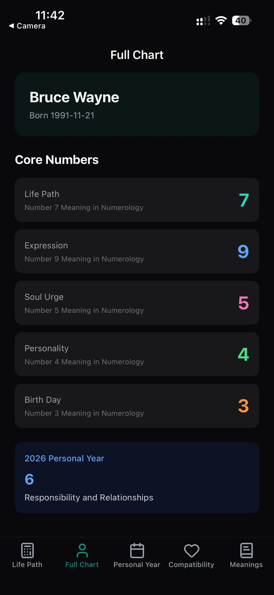
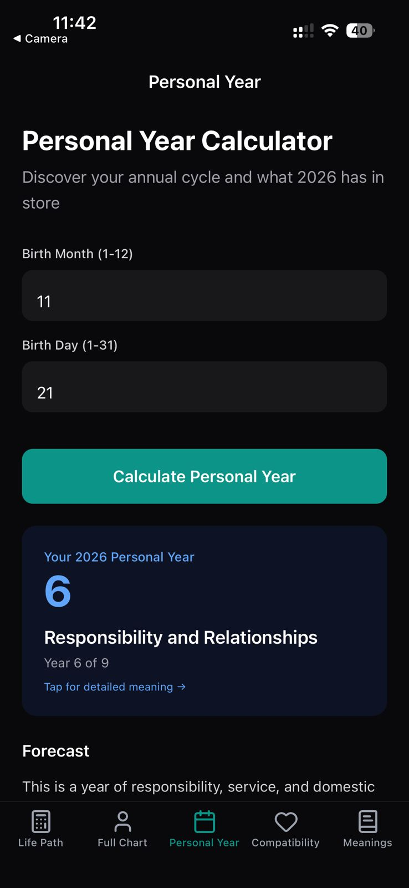
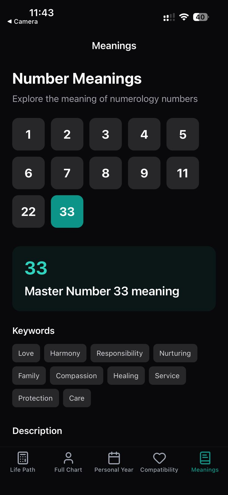
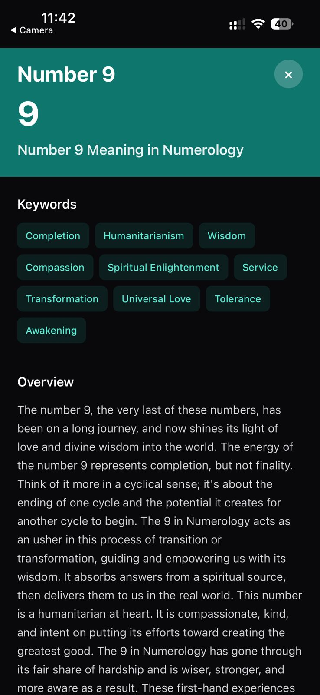
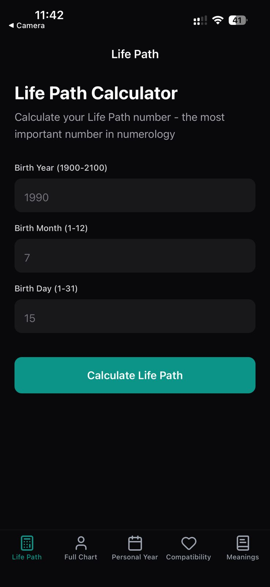

# RoxyAPI Numerology Starter

A fully functional numerology calculator app built with React Native Expo and TypeScript, powered by the RoxyAPI Numerology API. Calculate Life Path, Expression, Soul Urge, and other core numerology numbers with detailed interpretations.

## Screenshots

<p align="center">
  
  
  
</p>
<p align="center">
  
  
  
</p>

## Features

Build a professional numerology app with essential features:

- **Life Path Calculator**: Calculate the most important numerology number from birth date
- **Full Numerology Chart**: Generate complete numerology profile with all core numbers
- **Personal Year Forecast**: Annual cycle and forecast calculations
- **Compatibility Analysis**: Check numerology compatibility between two people
- **Number Meanings**: Explore detailed meanings for numbers 1-9, 11, 22, and 33
- **Master Numbers**: Automatic detection of Master Numbers (11, 22, 33)
- **Karmic Debt**: Identify Karmic Debt numbers (13, 14, 16, 19)
- **Dark Mode Ready**: Automatic light/dark mode support with teal theme
- **Interactive Number Details**: Tap any number to see full meanings with strengths, challenges, career, relationships, and spiritual insights

## Tech Stack

- **Expo SDK 54** - React Native development platform
- **Expo Router** - File-based navigation with bottom tabs
- **TypeScript** - Type-safe development
- **NativeWind v4** - Tailwind CSS for React Native styling
- **openapi-fetch** - Type-safe API client
- **Lucide Icons** - Beautiful icons for navigation
- **RoxyAPI Numerology API** - Professional numerology calculations
- **Auto-generated Types** - TypeScript types from OpenAPI schema

## Quick Start

### 1. Clone and Install

```bash
git clone https://github.com/RoxyAPI/numerology-starter-app
cd numerology-starter-app
npm install
```

### 2. Get Your API Key

Visit [roxyapi.com/pricing](https://roxyapi.com/pricing) to sign up and get your API key. RoxyAPI provides professional numerology calculations with:

- Life Path, Expression, Soul Urge, Personality, Birth Day, Maturity numbers
- Master Number detection (11, 22, 33)
- Karmic Debt and Karmic Lessons analysis
- Personal Year forecasts
- Compatibility calculations
- Comprehensive numerology charts
- Detailed 300-500 word interpretations for every number

### 3. Configure Environment

Create a `.env` file in the project root:

```env
EXPO_PUBLIC_ROXYAPI_KEY=your_api_key_here
EXPO_PUBLIC_ROXYAPI_BASE_URL=https://roxyapi.com/api/v2
```

### 4. Run the App

```bash
# Start Expo development server
npm start

# Run on iOS
npm run ios

# Run on Android
npm run android

# Run on web
npm run web
```

## Project Structure

```
numerology-starter-app/
├── app/
│   ├── (tabs)/
│   │   ├── index.tsx          # Life Path calculator
│   │   ├── chart.tsx           # Full numerology chart
│   │   ├── personal-year.tsx   # Personal year forecast
│   │   ├── compatibility.tsx   # Compatibility checker
│   │   └── meanings.tsx        # Number meanings explorer
│   └── _layout.tsx             # Root layout
├── src/
│   ├── api/
│   │   ├── client.ts           # API client setup
│   │   ├── numerology.ts       # API methods
│   │   ├── schema.ts           # Generated types from OpenAPI
│   │   └── types.ts            # Type exports
│   ├── components/
│   │   └── RoxyBranding.tsx    # API key setup screen
│   └── constants/
│       └── colors.ts           # Theme colors
├── assets/                     # Logo, icons, images
├── .env                        # Environment variables
└── package.json
```

## API Endpoints Used

The app demonstrates these RoxyAPI Numerology endpoints:

```typescript
// Life Path calculation
POST /life-path
{ year: 1990, month: 7, day: 15 }

// Expression number
POST /expression
{ fullName: "John Smith" }

// Soul Urge number
POST /soul-urge
{ fullName: "John Smith" }

// Complete numerology chart
POST /chart
{ fullName: "John Smith", year: 1990, month: 7, day: 15, currentYear: 2026 }

// Number meanings
GET /meanings/{number}

// And more: /personality, /birth-day, /maturity, /karmic-lessons, 
// /karmic-debt, /personal-year, /compatibility
```

## Type Safety

The app uses auto-generated TypeScript types from the RoxyAPI OpenAPI schema:

```bash
# Regenerate types when API updates
npm run generate:types
```

Types are automatically generated from:
```
https://roxyapi.com/api/v2/numerology/openapi.json
```

## Styling

Built with **NativeWind v4** (Tailwind CSS for React Native):

- `className="text-3xl font-bold text-zinc-900 dark:text-white"` - Tailwind classes
- Automatic dark mode with `dark:` prefix
- Teal brand color (`teal-600`)
- Zinc gray scale for text and backgrounds

## Building for Production

### iOS

```bash
eas build --platform ios
```

### Android

```bash
eas build --platform android
```

Requires [Expo Application Services (EAS)](https://expo.dev/eas) account.

## Customization Tips

1. **Add more calculators**: The API supports Expression, Soul Urge, Personality, Maturity, Karmic Lessons, and more
2. **Enhance UI**: Add animations with Reanimated, charts with Victory Native
3. **Save calculations**: Use AsyncStorage to save user's numerology profile
4. **Share results**: Add share functionality for calculated numbers
5. **Multi-language**: The API returns English interpretations - add i18n for UI text
6. **Custom colors**: Modify `src/constants/colors.ts` and Tailwind config

## Learn More

- **API Documentation**: [roxyapi.com/docs](https://roxyapi.com/docs)
- **OpenAPI Schema**: [roxyapi.com/api/v2/numerology/openapi.json](https://roxyapi.com/api/v2/numerology/openapi.json)
- **Pricing**: [roxyapi.com/pricing](https://roxyapi.com/pricing)
- **Expo Documentation**: [docs.expo.dev](https://docs.expo.dev)

## Support

- API Documentation: [roxyapi.com/docs](https://roxyapi.com/docs)
- Get API Key: [roxyapi.com/pricing](https://roxyapi.com/pricing)

## License

MIT - Feel free to use this starter for your own numerology app projects.

---

**Built with ❤️ using [RoxyAPI](https://roxyapi.com) - Professional APIs for developers**
